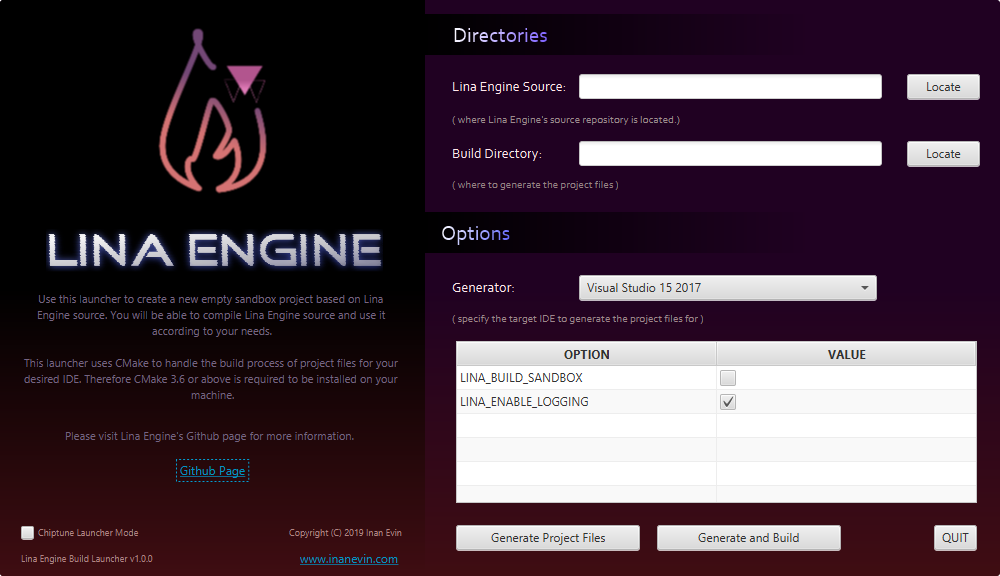

## Lina Engine Build Launcher

 

This is a utility tool for generating project files from Lina Engine source code and building them. [Lina Engine Repository](https://github.com/inanevin/LinaEngine)
uses CMake as a build system. This tool simplifies the process of running CMake commands. You can use CMake from shell or CMake GUI to
generate project files for Lina Engine and build them, or you can use this Launcher for a simplified interface.

## Usage

- Select the source directory. This is the directory of your Lina Engine source repo/clone/download.
- Select the target directory (build directory) for the generated project files.
- Select your generator.
- Hit Generate Project Files to generate the project files, or Generate and Build to generate and build the binaries afterwards.
